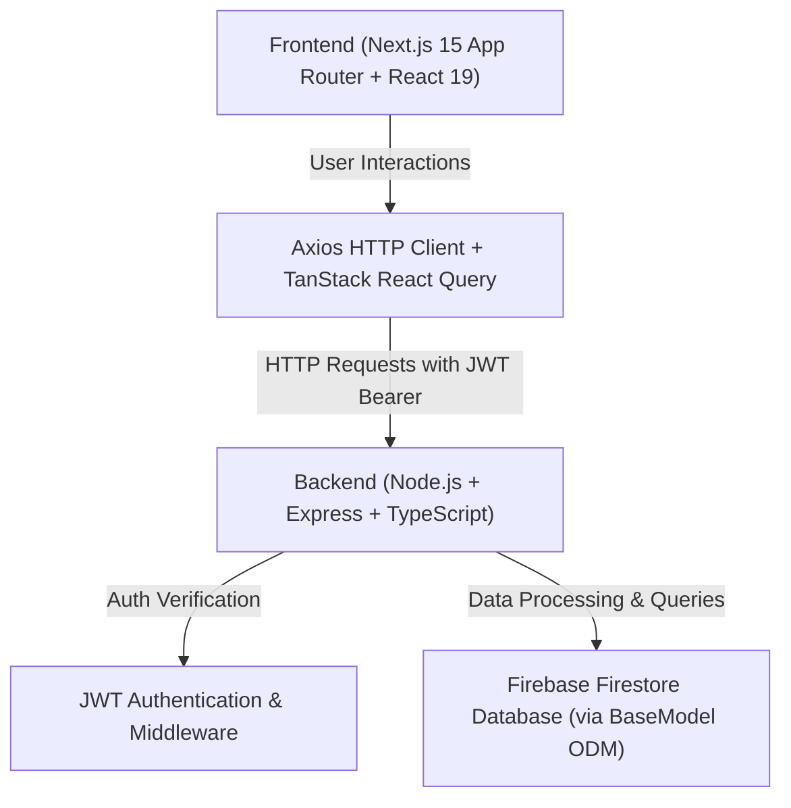

# LogicSchedule

LogicSchedule is an enterprise-grade schedule, batch, teacher, and attendance management web application built for educational institutions, academies, and coaching centers. It provides real-time availability tracking, calendar view scheduling, conflict detection, demo session management, and role-based access control (Admin, Super Admin, Sub Admin, Teacher, Sales).

---

## Table of Contents
- [Architecture & Tech Stack](#architecture--tech-stack)
- [Directory & Code Structure](#directory--code-structure)
- [Server & Frontend Connection (API Integration)](#server--frontend-connection-api-integration)
- [Data Modeling & Database Architecture](#data-modeling--database-architecture)
- [Data Structures & Algorithms (DSA) Used](#data-structures--algorithms-dsa-used)
- [Key Features](#key-features)
- [Environment Setup & Installation](#environment-setup--installation)

---

## Architecture & Tech Stack



### Tech Stack:
- **Frontend**: Next.js 15 (App Router), React 19, TypeScript, Tailwind CSS v4, Lucide React, Framer Motion, TanStack React Query, Recharts, Zustand.
- **Backend**: Node.js, Express.js, TypeScript, JSON Web Tokens (JWT), bcryptjs.
- **Database**: Firebase Cloud Firestore (with custom `BaseModel` Mongoose-like ODM layer).

---

## Directory & Code Structure

```text
Logicschedule/
├── backend/
│   ├── config/
│   │   └── firebase.ts            # Firebase Admin SDK initialization & Firestore DB instance
│   ├── controllers/               # Business logic controllers
│   │   ├── authController.ts      # Authentication & user registration logic
│   │   ├── batchController.ts     # Batch creation & automated schedule generation
│   │   ├── scheduleController.ts  # Schedule CRUD & student schedule queries
│   │   ├── statsController.ts     # Dashboard live metrics & live teacher availability
│   │   ├── teacherController.ts   # Teacher profile, status & availability algorithms
│   │   ├── studentController.ts   # Student directory & batch assignments
│   │   └── demoSessionController.ts # Demo session management
│   ├── middleware/
│   │   └── authMiddleware.ts      # JWT verification & role authorization (Admin/Teacher)
│   ├── models/
│   │   ├── BaseModel.ts           # Core ODM class providing query chaining, filtering & population
│   │   ├── Batch.ts               # Batch model definition
│   │   ├── Schedule.ts            # Schedule model definition
│   │   ├── Teacher.ts             # Teacher model definition
│   │   └── User.ts                # User authentication model definition
│   ├── routes/                    # API route definitions
│   └── index.ts                   # Express app server entry point
│
├── frontend/
│   ├── src/
│   │   ├── app/                   # Next.js App Router pages
│   │   │   ├── dashboard/
│   │   │   │   ├── page.tsx       # Live Dashboard stats & real-time availability list
│   │   │   │   ├── schedule/      # Interactive calendar schedule grid (Day/Week/Month)
│   │   │   │   ├── teachers/      # Teacher directory, duty status & timing tables
│   │   │   │   ├── batches/       # Batch management & session generation
│   │   │   │   └── attendance/    # Class attendance tracking
│   │   │   ├── login/             # Login page
│   │   │   └── layout.tsx         # Global layout & React Query provider
│   │   ├── components/            # Reusable UI & modal components
│   │   ├── lib/
│   │   │   └── axios.ts           # Axios instance configured with JWT auth headers
│   │   ├── hooks/                 # Custom React hooks (e.g., usePermissions)
│   │   └── store/                 # Global state management (authStore, searchStore)
│   └── globals.css                # Tailwind v4 configuration & base styles
```

---

## Server & Frontend Connection (API Integration)

The frontend communicates seamlessly with the backend REST API via an optimized HTTP layer:

1. **Authentication Token Interceptor**:
   The frontend Axios client ([`axios.ts`](file:///c:/Users/js202/Logicshedule/Logicschedule/frontend/src/lib/axios.ts)) automatically injects the JWT token stored in `localStorage` into every outgoing request header:
   ```typescript
   config.headers.Authorization = `Bearer ${token}`;
   ```

2. **Server Security & Middleware**:
   The backend route guard ([`authMiddleware.ts`](file:///c:/Users/js202/Logicshedule/Logicschedule/backend/middleware/authMiddleware.ts)) extracts the Bearer token, verifies its signature using JWT, and attaches the decoded `user` object to the Express request (`req.user`). Role-based authorization ensures only authorized users perform actions (e.g. Admins managing schedules or teachers viewing assigned classes).

3. **Client-Side Caching & Auto-Refresh**:
   Using **TanStack React Query**, data requests (e.g. `["dashboard-stats"]`, `["schedules"]`) are cached on the client. Auto-refetch intervals (e.g., 30-second refetch for dashboard stats) keep the UI updated without manual page reloads.

---

## Data Modeling & Database Architecture

Although **Firebase Firestore** is a NoSQL document database, LogicSchedule uses a custom Object Document Mapper ([`BaseModel.ts`](file:///c:/Users/js202/Logicshedule/Logicschedule/backend/models/BaseModel.ts)) to support relational querying patterns:

### Core Collections & Schema Relationships:
- **`users`**: Authentication credentials (`email`, `password`, `role`: `'Admin' | 'Teacher' | 'Sales'`).
- **`teachers`**: Teacher profiles linked to `users` via foreign key (`user: String`). Stores `dutyStatusSchedule`, `subjectExpertise`, and status (`'Available' | 'In Class' | 'On Leave' | 'Off Duty'`).
- **`batches`**: Class batches linked to teachers (`assignedTeacher: String`). Stores class schedule info (`timing`, `days`, `startDate`, `endDate`).
- **`schedules`**: Individual calendar class entries linked to `teachers` (`teacher: String`) and `batches` (`batch: String`). Includes `date`, `startTime`, `endTime`, `status`, and `attendance`.

### Relational Population (`.populate()`):
`BaseModel` implements lazy population. When executing `.populate('teacher')`, foreign keys stored as document IDs are automatically replaced with their referenced document objects.

---

## Data Structures & Algorithms (DSA) Used

To ensure maximum system efficiency and low rendering latency, the repository incorporates specific data structures and algorithmic choices:

### 1. $O(1)$ Hash Maps for Calendar Grid Rendering
- **Problem**: In the calendar view ([`schedule/page.tsx`](file:///c:/Users/js202/Logicshedule/Logicschedule/frontend/src/app/dashboard/schedule/page.tsx)), checking event matches for each cell (7 days $\times$ 14 hours = 98 cells, or 35 days $\times$ 14 hours = 490 cells) using linear `.find()` search results in $O(\text{Cells} \times N)$ operations per render cycle.
- **DSA Solution**: Pre-computes a memoized Hash Map (`Map<string, PopulatedScheduleEntry>`) keyed by `${dateStr}_${hour}`. Looking up events per cell is reduced to **$O(1)$ constant time**.

### 2. $O(1)$ Hash Sets for Automated Schedule Generation
- **Problem**: Generating batch schedules across date ranges requires checking if a given date falls on a selected class day (e.g., Monday, Wednesday, Friday).
- **DSA Solution**: Converted day selections into a Hash Set (`Set<number>`) in [`batchController.ts`](file:///c:/Users/js202/Logicshedule/Logicschedule/backend/controllers/batchController.ts). Day membership checking inside date loop iteration executes in **$O(1)$ time** (`selectedDayIndexes.has(cursor.getDay())`).

### 3. $O(T + S)$ Pre-Grouped Maps for Live Status Computation
- **Problem**: Matching live ongoing classes to teachers in [`statsController.ts`](file:///c:/Users/js202/Logicshedule/Logicschedule/backend/controllers/statsController.ts) and [`teacherController.ts`](file:///c:/Users/js202/Logicshedule/Logicschedule/backend/controllers/teacherController.ts) originally ran in $O(T \times S)$ nested loops over all teachers ($T$) and schedules ($S$).
- **DSA Solution**: Pre-indexes today's schedules into a `Map<string, Schedule[]>` keyed by `teacherId`. Lookup per teacher is **$O(1)$**, reducing overall complexity to **$O(T + S)$**.

### 4. Parallel Query Execution & Multi-Fetch Caching
- **Problem**: Sequential database queries introduce cumulative network roundtrip latencies.
- **DSA Solution**: Replaced sequential `await` queries with `Promise.all([...])` in database controllers to execute count queries concurrently. Added pre-collected ID sets during database population in [`BaseModel.ts`](file:///c:/Users/js202/Logicshedule/Logicschedule/backend/models/BaseModel.ts) to eliminate $N+1$ query overhead.

---

## Key Features

1. **Live Status & Timings Dashboard**:
   - Real-time teacher status indicator (`In Class`, `Class Starting Soon`, `Available`, `On Leave`, `Off Duty`).
   - Countdown timer for ongoing classes (`m left`) and upcoming classes.
   - Limited 4-row initial view with an expandable "View More" toggle.
2. **Interactive Schedule Calendar**:
   - Day, Week, and Month views with conflict detection warnings.
   - Filtering by Teacher and Batch.
3. **Batch Auto-Scheduler**:
   - Automatically generates recurring class schedules for custom date ranges and day selections.
4. **Attendance Tracking & Performance Analytics**:
   - Student-level attendance logging and visual statistics using Recharts area graphs.

---

## Environment Setup & Installation

### Prerequisites:
- **Node.js**: v18.x or higher
- **npm**: v9.x or higher

### 1. Backend Setup:
```bash
# Navigate to backend directory
cd backend

# Install dependencies
npm install

# Create environment file (.env)
# Add required Firebase & JWT variables (see .env.example)

# Start development server
npm run dev
```

### 2. Frontend Setup:
```bash
# Navigate to frontend directory
cd frontend

# Install dependencies
npm install

# Create environment file (.env)
NEXT_PUBLIC_API_URL=http://localhost:5000/api

# Start Next.js development server
npm run dev
```

Open [http://localhost:3000](http://localhost:3000) in your browser to access LogicSchedule.
